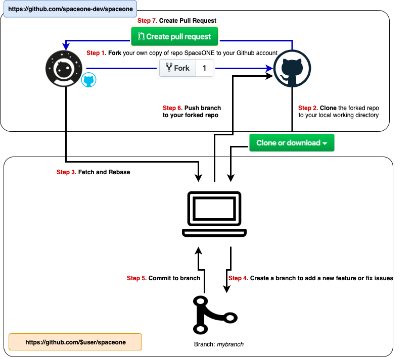

Development workflow

### 1. Fork in the cloud

1. Visit https://github.com/spaceone-dev
2. There are lots of repositories. *spaceone* is top repository. Each micro service has own repository like *identity*, or *inventory*.
3. Click 'Fork' button (top right) to establish a cloud-based fork.

### 2. Clone fork to local storage

Create your clone:
~~~sh
git clone https://github.com/$user/spaceone.git
cd  spaceone
~~~

### 3. Branch

Add upstream:

~~~sh
git remote add upstream https://github.com/spaceone-dev/spaceone.git

# Never push to upstream master
git remote set-url --push upstream no_push

# Confirm that your remotes make sense:
git remote -v
~~~

Get your local master up to date:

~~~sh
git fetch upstream
git checkout master
git rebase upstream/master
~~~

Branch from it:

~~~sh
git checkout -b myfeature
~~~

### 5. Commit

Commit your changes.

~~~sh
git add <changed files>
git commit -s
~~~

Likely you go back and edit/build/test some more then 'commit --amend' in a few cycles.

### 6. Push

When ready to review (or just to establish an offsite backup of your work),
push your branch to your fork on `github.com`:

~~~sh
git push -f origin myfeature
~~~

### 7. Create a pull request

1. Visit your fork at `https://github.com/$user/spaceone`
2. Click the `Crete pull request` button
